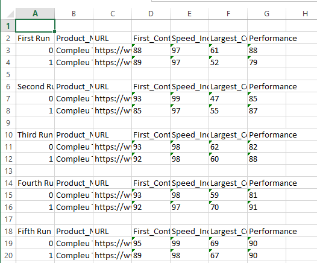

#### USE PYTHON TO AUTOMATE GOOGLE LIGHTHOUSE REPORTS AND KEEP A HISTORICAL RECORD OF THESE

### Use Instructions

1. Clone or fork this repository.
2. Launch the Python file in Visual Code or any IDE and run the following command: `python name_of_the_file.py`
3. Please, have the following before running the script:

- Python 3.X
- Node.js on your local machine
- npm install -g lighthouse
- pip3 install openpyxl
- pip3 install DateTime
- pip3 install join
- pip3 install export

4. After running the script, it will generate 2 .csv files: one for the desktop and another for mobile results and a JSON file.
5. Take this personal Medium article as a reference for a better understanding of the code:  https://medium.com/@olimpiuseulean/use-python-to-automate-google-lighthouse-reports-and-keep-a-historical-record-of-these-65f378325d64

6. Results for the desktop report:
   
